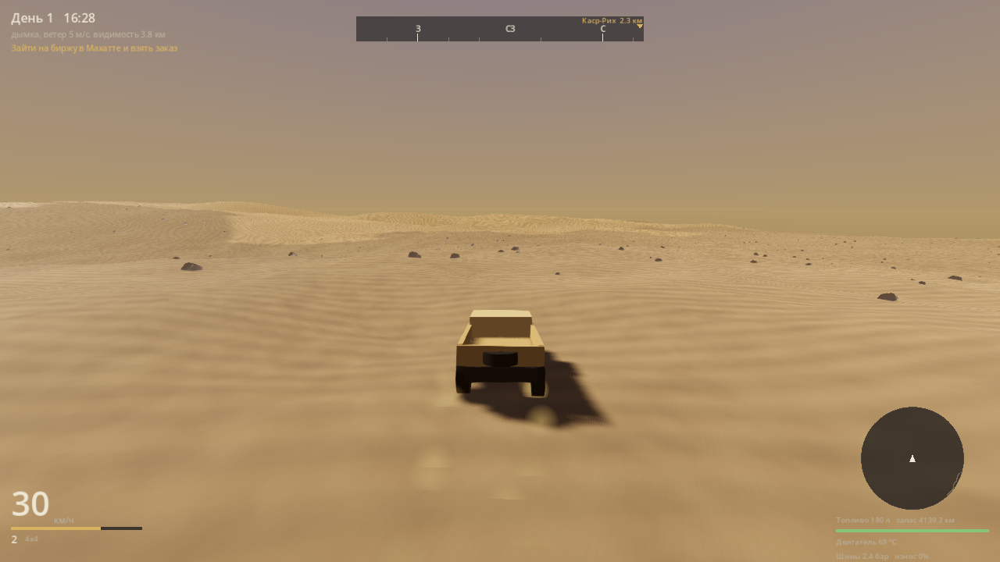

# Хамсин

Курьерский симулятор в аравийской пустыне. Карта двадцать на двадцать
километров, честная физика внедорожника, груз, который бьётся о каждую кочку,
и сюжет, который начинается с чужого долга.

Движок — Godot 4.5.1, основная платформа — macOS (Metal). Собирается и
запускается также на Linux и Windows.



<p align="center">
  
  
</p>

## Запуск

```bash
# один раз: поставьте Godot 4.5.1 с godotengine.org
godot --path games/khamsin --editor      # открыть в редакторе
godot --path games/khamsin               # просто запустить
```

Из корня репозитория:

```bash
games/khamsin/tools/test.sh              # прогнать все тесты (около десяти секунд)
games/khamsin/tools/build.sh macOS       # собрать .app
```

## Управление

| Действие | Клавиши |
| --- | --- |
| Газ, тормоз, руль | W, S, A, D |
| Ручник | Пробел |
| Сцепление (в ручном режиме) | Shift |
| Передачи | E вверх, Q вниз |
| Полный привод | F |
| Блокировки дифференциалов | G |
| Пониженная передача | T (только на месте) |
| Давление в шинах | `[` и `]` |
| Фары | L |
| Камера | C |
| Карта, журнал | M, J |
| Взаимодействие в посёлке | Enter |
| Эвакуатор | R |
| Пауза | Esc |

Геймпад работает: стики — руль и обзор, курки — газ и тормоз.

## Что это за игра

Вы получили в наследство грузовик и двадцать две тысячи долга. Долг гасится
рейсами: берёте груз на бирже, довозите до другого посёлка, получаете деньги
минус штрафы за опоздание и за то, что довезли не целиком.

Интересное начинается там, где заканчивается накатка. По песку машина едет
вдвое медленнее и жрёт вдвое больше. Спущенные до полутора бар колёса
увеличивают пятно контакта вдвое, машина перестаёт закапываться — но на камне
такая резина греется и стирается. Ползание по дюнам на первой передаче греет
двигатель, а перегретый двигатель теряет треть мощности. Хрупкий груз считает
каждый удар. Песчаная буря отбирает видимость и сдувает пустой кузов с курса.

Ни одна из этих механик не является числом в таблице: всё это следствия одной
физической модели.

## Как устроено

```
games/khamsin/
  project.godot        Godot 4.5, Forward+, Metal на macOS, физика 120 Гц, Jolt
  src/core/            автолоады: конфиг, случайность, шина событий, сейвы,
                       настройки, состояние прохождения, телеметрия, экраны
  src/vehicle/         шина, подвеска, трансмиссия, кузов, камера
  src/world/           рельеф, дорожная сеть, чанки, погода, небо, сцена мира
  src/gameplay/        грузы, контракты, экономика, улучшения
  src/story/           условия, последствия, диалоги, главы
  src/ui/              оформление, приборы, экраны
  data/                машины, грузы, посёлки, улучшения, сюжет — всё в JSON
  shaders/             песок и небо
  tests/               101 тест, свой раннер без внешних зависимостей
  tools/               тесты, стенд телеметрии, снимки экрана, сборка
```

### Физика

Шина считается по нормированной формуле Пацейки с комбинированным
скольжением: продольная и боковая силы делят один и тот же запас сцепления
через эллипс трения — отсюда и то, что газ в повороте съедает поворот.
Сингулярности на нулевой скорости нет: скольжение фильтруется длиной
релаксации каркаса, как в реальной шине.

Пятно контакта берётся из простого и честного соотношения: воздух в шине
держит нагрузку, значит площадь равна нагрузке, делённой на давление. Отсюда
следует всё остальное — просадка в грунт по закону «давление — просадка»,
сопротивление сгребанию песка и выигрыш от спуска колёс.

Подвеска — пружина с раздельными ходами сжатия и отбоя, отбойником в конце
хода и стабилизаторами поперечной устойчивости. Двигатель — кривая момента с
регулятором холостых, отсечкой, нагревом и расходом по удельному расходу
топлива. Дальше сцепление с проскальзыванием, коробка (автомат и ручной
режим), раздатка и дифференциалы, свободные или блокируемые.

Вращение колёс интегрируется подшагами внутри кадра физики: без этого
буксующее колесо на 120 Гц теряет устойчивость.

### Мир

Рельеф — чистая функция координат. Одну и ту же функцию зовут генератор меша,
генератор коллизии, построитель маршрутов и запрос «что под колесом», поэтому
картинка, физика и грунт заведомо описывают одну землю.

Дюны собраны из асимметричного профиля: длинный пологий наветренный склон и
короткий крутой подветренный, до тридцати трёх градусов — угла естественного
откоса песка. Вверх заезжаешь, вниз падаешь.

Дороги никто не рисовал. Они прокладываются поиском пути по стоимости, где
дорого лезть в склон и дорого идти по рыхлому песку, а потом выравнивают под
собой землю и меняют покрытие на накатку.

Мир целиком выводится из сида: сохранение хранит число, а не миллион вершин.
Одинаковый сид даёт одинаковую пустыню на любой машине.

### Данные

Машины, грузы, посёлки, улучшения, главы и диалоги лежат в `data/` обычным
JSON. В коде машины нет ни одного магического числа: балансировать её
пересборкой было бы издевательством. Условия и последствия в сюжете — это
фиксированный набор ключей, а не язык внутри JSON: опечатка ругается вслух, а
не молча не срабатывает.

## Проверка

```bash
tools/test.sh                 # всё
tools/test.sh --filter tire   # только шина
```

Тесты не полагаются ни на один внешний плагин. Юнит-тесты проверяют формулы,
интеграционные — настоящую физику: осадку на подвеске, распределение веса,
тормозной путь, разницу песка и хамады, заезды по сгенерированным дюнам.
Отдельно проверяется связность данных — что диалоги не ведут в несуществующие
узлы, а биты сюжета не ждут посёлков, которых нет на карте.

Три бага, которые нашлись только глазами и теперь закрыты тестами: обратный
порядок обхода треугольников (движок молча переставал рисовать ландшафт),
`return` внутри fragment-шейдера (шейдер не собирается, поверхность исчезает) и
потеря точности процедурного шума на координатах в тысячи метров.

## Замеры

Числа получены стендом, а не выдуманы для описания. Воспроизводятся командой
из следующего раздела.

Разгон и максимальная скорость, машина без груза:

| Покрытие | 0-30 км/ч | 0-60 км/ч | Максимум |
| --- | --- | --- | --- |
| Асфальт | 2.8 с | 7.7 с | 114 км/ч |
| Накатка | 2.8 с | 8.1 с | 108 км/ч |
| Хамада | 3.0 с | 8.9 с | 100 км/ч |
| Плотный песок | 4.0 с | 12.8 с | 74 км/ч |
| Рыхлый песок | 8.8 с | — | 34 км/ч |

Тормозной путь с шестидесяти:

| Покрытие | Путь | Замедление |
| --- | --- | --- |
| Асфальт | 18.3 м | 0.77 g |
| Накатка | 19.5 м | 0.73 g |
| Хамада | 21.5 м | 0.66 g |
| Плотный песок | 24.5 м | 0.58 g |

Давление в шинах на рыхлом песке — двадцать секунд полного газа с места:

| Давление | Пройдено | Скорость | Просадка колеса |
| --- | --- | --- | --- |
| 2.8 бар | 92 м | 29 км/ч | 38 см |
| 2.4 бар | 92 м | 29 км/ч | 38 см |
| 1.8 бар | 136 м | 35 км/ч | 30 см |
| 1.4 бар | 163 м | 40 км/ч | 24 см |
| 1.0 бар | 193 м | 50 км/ч | 18 см |

Спуск колёс с 2.4 до 1.0 бар удваивает пройденное расстояние и поднимает
скорость с двадцати девяти до пятидесяти. Ни одно из этих чисел нигде не
задано: они выходят из того, что площадь пятна равна нагрузке, делённой на
давление, а просадка в песок — из давления в пятне.

## Инструменты

```bash
# стенд телеметрии: разгон, тормозной путь, влияние давления, предельный уклон
godot --headless --path games/khamsin res://tools/bench_vehicle.tscn

# снимок мира в PNG без запуска игры руками
godot --path games/khamsin --rendering-driver vulkan --resolution 1280x720 \
  res://tools/screenshot.tscn -- --out /tmp/shot.png --hour 8.5 --drive 6
```

Стенд ничего не утверждает — он измеряет. Пороговые проверки живут в тестах, а
сюда ходят, когда поменяли настройки машины и хотят понять, что изменилось.

## Сборка под macOS

```bash
games/khamsin/tools/build.sh macOS
```

Скрипт проверяет версию движка, импортирует ресурсы, прогоняет тесты и
собирает универсальный бинарник в `build/`. Шаблоны экспорта Godot ставит сам
при первом запуске редактора; в консольной сборке скрипт скажет, куда их
положить.

Свежесобранное приложение macOS карантинит:

```bash
xattr -dr com.apple.quarantine build/Khamsin.app
```

Для распространения нужны подпись и нотаризация — параметры лежат в
`export_presets.cfg`.

## Чего здесь нет

Честный список, чтобы не было сюрпризов.

- **Художественных ассетов.** Вся геометрия процедурная или собрана из
  примитивов, текстур нет вообще: песок и небо считаются в шейдере. Силуэт
  грузовика узнаваем, но это силуэт.
- **Звука.** Шины аудио готовы (шина событий, громкости, разделение по
  каналам), самих звуков нет.
- **Контента.** Девять посёлков, десять типов груза, восемь улучшений, одна
  глава сюжета целиком и начало второй. Это вертикальный срез: цикл замкнут от
  меню до сдачи груза, но играть в него неделю нечем.
- **Мультиплеера и консолей.**

Что из этого доделывается контентом, а что требует новых систем, видно по
структуре: добавить посёлок — это строчка в JSON, добавить погоду со снегом —
это новая система.

## Лицензия

Код проекта. Внешних ассетов нет, поэтому и чужих лицензий тоже.
